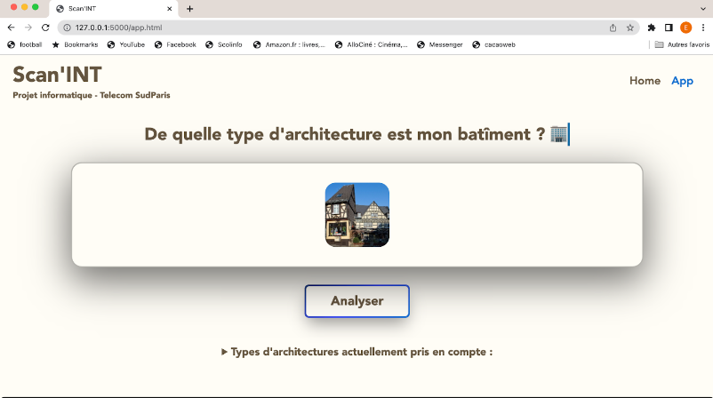

# Scan'INT :office: :iphone:

Projet d'informatique 1A : NAAMA, COLE, ZOUGHEBI, BRUN, ABRI

Scan'INT est une application web crée dans le cadre du projet PRO3600 de Télécom SudParis.

L'application Scan'INT permet de reconnaître l'architecture d'un bâtiment envoyé par l'utilisateur, parmis plus d'une vingtaine de styles architecturaux.

## Home Page

  

## App Page

  

## Use Case
 

  

